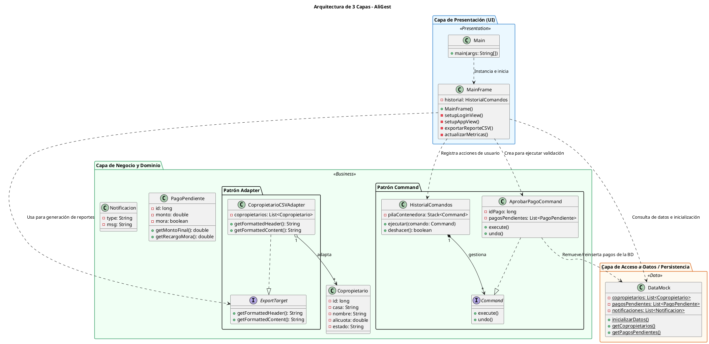

# Diagrama de Arquitectura de 3 Capas

Este documento presenta el diagrama de arquitectura de la aplicación **AliGest** modelado bajo el patrón de **Tres Capas** y expresado en notación de bloques de **PlantUML**.

---

## Representación en PlantUML

Puedes copiar y pegar el siguiente código en cualquier herramienta de renderizado de PlantUML (como el servidor oficial de PlantUML o la extensión de VS Code) para visualizar el diagrama.

---

## Explicación del Diagrama de Arquitectura

1. **Flujo Unidireccional y Desacoplado:**
   - La **Capa de Presentación** (`com.aligest.ui`) depende de la **Capa de Negocio** y de la **Capa de Datos** únicamente a través de interfaces y consultas de lectura/escritura seguras. La presentación jamás altera la lógica interna ni los datos directamente; solicita acciones.
2. **Ubicación de los Patrones:**
   - Los patrones **Command** y **Adapter** residen en la frontera de la **Capa de Negocio**, actuando como mediadores:
     - El **Command** intermedia entre el usuario de la UI que presiona "Aprobar" y el modelo financiero que debe removerse de la lista de pagos pendientes.
     - El **Adapter** intermedia entre la UI que requiere exportar texto estructurado (`ExportTarget`) y la colección interna de datos que maneja el negocio.
3. **Capa de Datos Simplificada:**
   - `DataMock` actúa como la base de datos en memoria, abstrayendo a las capas superiores de cómo se almacena o recupera la información.
