# Diagrama de Clases en PlantUML

Este documento presenta el diagrama de clases detallado del sistema **AliGest** modelado en **PlantUML**.

---

## Representación en PlantUML

El siguiente código describe todas las relaciones de herencia (realizaciones de interfaz), agregación, asociación y dependencia del proyecto:

```plantuml
@startuml
skinparam classAttributeIconSize 0
skinparam BoxPadding 10

title Diagrama de Clases - AliGest

package com.aligest.model {
    class Copropietario {
        - id: long
        - casa: String
        - nombre: String
        - alicuota: double
        - estado: String
        - telefono: String
        - correo: String
        + Copropietario(id: long, casa: String, nombre: String, alicuota: double, estado: String, telefono: String, correo: String)
        + getId(): long
        + getCasa(): String
        + getNombre(): String
        + getAlicuota(): double
        + getEstado(): String
        + getTelefono(): String
        + getCorreo(): String
        + setEstado(estado: String)
    }

    class PagoPendiente {
        - id: long
        - fecha: String
        - casa: String
        - nombre: String
        - monto: double
        - mora: boolean
        - expensa: String
        + PagoPendiente(id: long, fecha: String, casa: String, nombre: String, monto: double, mora: boolean, expensa: String)
        + getId(): long
        + getFecha(): String
        + getCasa(): String
        + getNombre(): String
        + getMonto(): double
        + isMora(): boolean
        + getExpensa(): String
        + getMontoFinal(): double
        + getRecargoMora(): double
    }

    class Notificacion {
        - type: String
        - msg: String
        - time: String
        + Notificacion(type: String, msg: String, time: String)
        + getType(): String
        + getMsg(): String
        + getTime(): String
    }
}

package com.aligest.repository {
    class DataMock {
        - {static} copropietarios: List<Copropietario>
        - {static} pagosPendientes: List<PagoPendiente>
        - {static} notificaciones: List<Notificacion>
        + {static} inicializarDatos(): void
        + {static} getCopropietarios(): List<Copropietario>
        + {static} getPagosPendientes(): List<PagoPendiente>
        + {static} getNotificaciones(): List<Notificacion>
    }
}

package com.aligest.command {
    interface Command {
        + execute(): void
        + undo(): void
    }

    class AprobarPagoCommand {
        - idPago: long
        - pagosPendientes: List<PagoPendiente>
        - pagoRespaldado: PagoPendiente
        - posicionOriginal: int
        - updateUI: Runnable
        + AprobarPagoCommand(idPago: long, pagosPendientes: List<PagoPendiente>, updateUI: Runnable)
        + execute(): void
        + undo(): void
        + getPagoRespaldado(): PagoPendiente
    }

    class HistorialComandos {
        - pilaContenedora: Stack<Command>
        + ejecutar(comando: Command): void
        + deshacer(): boolean
        + limpiar(): void
    }
}

package com.aligest.adapter {
    interface ExportTarget {
        + getFormattedHeader(): String
        + getFormattedContent(): String
    }

    class CopropietarioCSVAdapter {
        - copropietarios: List<Copropietario>
        + CopropietarioCSVAdapter(copropietarios: List<Copropietario>)
        + getFormattedHeader(): String
        + getFormattedContent(): String
    }
}

package com.aligest.ui {
    class MainFrame {
        - historial: HistorialComandos
        - activeToasts: List<JPanel>
        + MainFrame()
        - setupLoginView(): void
        - setupAppView(): void
        - setupDashboardPanel(): void
        - setupCopropietariosPanel(): void
        - setupPagosPanel(): void
        - setupNotificacionesPanel(): void
        - setupReportesPanel(): void
        - exportarReporteCSV(): void
        - actualizarMetricas(): void
        - llenarTablaCopropietarios(): void
        - llenarTablaPagos(): void
        - llenarNotificaciones(): void
    }
}

class Main {
    + {static} main(args: String[]): void
}

' Relaciones estructurales y de comportamiento
MainFrame --> HistorialComandos : "registra y deshace en"
MainFrame ..> AprobarPagoCommand : "instancia al aprobar"
MainFrame ..> CopropietarioCSVAdapter : "instancia al exportar"
MainFrame ..> ExportTarget : "consume"
Main ..> MainFrame : "instancia al arrancar"

AprobarPagoCommand ..|> Command
AprobarPagoCommand --> PagoPendiente : "respalda / manipula"
HistorialComandos o--> Command : "mantiene pila de"

CopropietarioCSVAdapter ..|> ExportTarget
CopropietarioCSVAdapter o--> Copropietario : "adapta lista de"

DataMock o--> Copropietario : "almacena en memoria"
DataMock o--> PagoPendiente : "almacena en memoria"
DataMock o--> Notificacion : "almacena en memoria"

MainFrame ..> DataMock : "consulta / modifica mediante"

@endum
```

---

## Explicación de las Relaciones Clave

1. **Realización de Interfaces (Línea de Puntos con Punta Vacía `..|>`):**
   - [AprobarPagoCommand.java](file:///c:/Users/Gabriel/Desktop/ADSW/SegundoParcial/AliGest/src/com/aligest/command/AprobarPagoCommand.java) realiza la interfaz [Command.java](file:///c:/Users/Gabriel/Desktop/ADSW/SegundoParcial/AliGest/src/com/aligest/command/Command.java).
   - [CopropietarioCSVAdapter.java](file:///c:/Users/Gabriel/Desktop/ADSW/SegundoParcial/AliGest/src/com/aligest/adapter/CopropietarioCSVAdapter.java) realiza la interfaz [ExportTarget.java](file:///c:/Users/Gabriel/Desktop/ADSW/SegundoParcial/AliGest/src/com/aligest/adapter/ExportTarget.java).
2. **Agregación (Línea con Diamante Vacío `o-->`):**
   - `HistorialComandos` agrega objetos que implementan `Command`. Indica que el historial de comandos está compuesto por comandos individuales pero estos pueden existir de forma independiente.
   - `CopropietarioCSVAdapter` agrega `Copropietario`, ya que contiene una referencia a la lista de copropietarios para adaptarlos.
3. **Asociación y Dependencia:**
   - [MainFrame.java](file:///c:/Users/Gabriel/Desktop/ADSW/SegundoParcial/AliGest/src/com/aligest/ui/MainFrame.java) tiene una relación directa y persistente con `HistorialComandos` (asociación representada por `-->`) y depende de la inicialización de los comandos y adaptadores en tiempo de ejecución (dependencia representada por `..>`).
